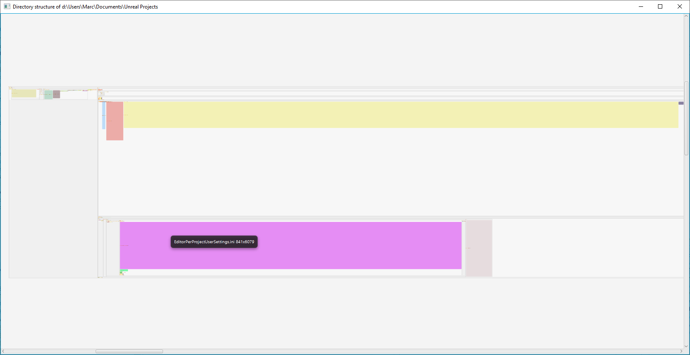

# Nested VBoxes and HBoxes in JavaFX

playing around with nested `VBox`es and `HBox`es in Java

## V 0.1: directory structure in nested VBoxes

## V0.2 VBox and HBox mixed up: every second level will be displayed in a HBox 

all other levels in VBoxes.

The resulting structure is very large